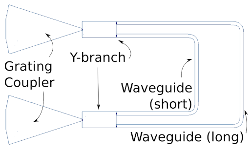
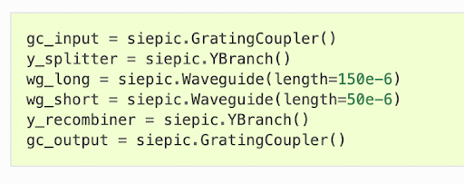
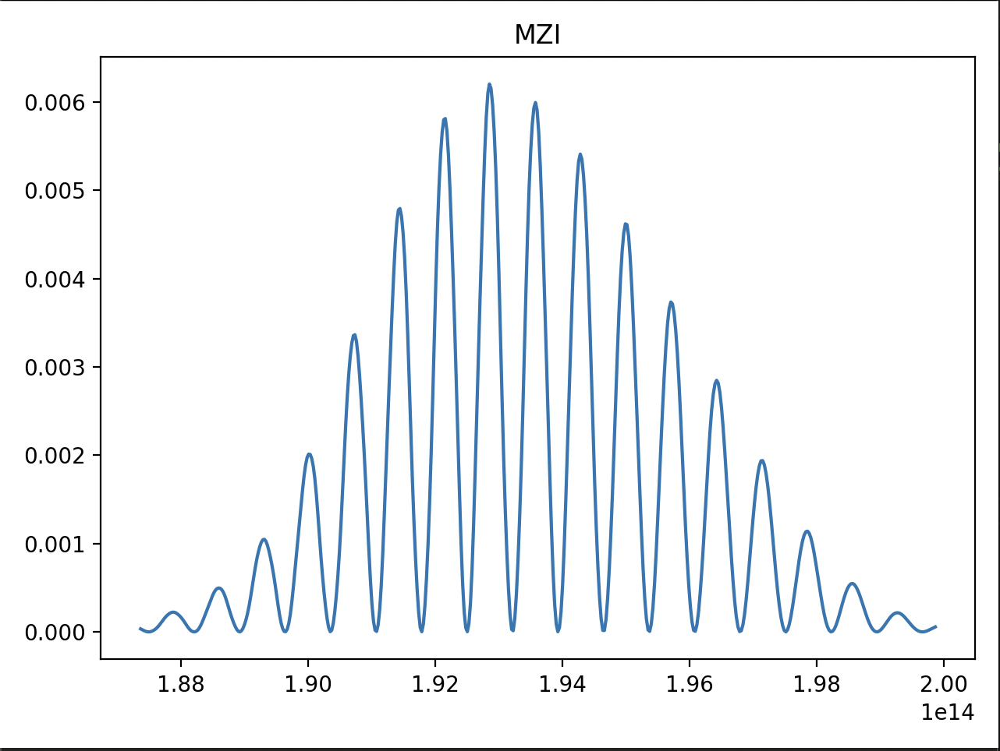
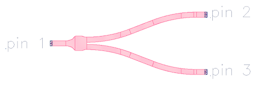

# EC601A1_14
EC601 semester long research project simulating the use of photonics to compute matrix multiplications. This repo hosts the work and research done by its contributors throughout the Fall 2022 semester. This project has ended but if you have feedback, advise, and any helpful tidbits of knowledge I would be very happy to hear from you. My email is samgul@bu.edu 

## Sprint 1
### Project Mission
Perform the matrix multiplications of various different size data sets on FPGA and Optical Processor

### MVP
Simulation and test benchmarks showing the difference between FPGA and Optical Processor

### Simulation and Hardware Options
1. Simphony
- Simulates photonic circuit in Python
- Open source software that is frequently being updated 
2. Noxim
- Simulates photonic circuit in C++
- Open source software that is not frequently being updated
3. FPGA
- Electronic Circuit
- Easy to Obtain

### Next Sprint Goals
1. Research and Acquire Necessary Hardware
2. Decide what simulation software(s) to utilize to achieve MVP
3. Start writing Verilog Files to load onto FPGA
4. Research current photonic hardware that is available for purchase by the public 

## Sprint 2

The team decided to split into two groups. One will focus on the FPGA while the other Photonic Simulations. **This repo is now dedicated to just the photonic simulations**

### New MVP
Simulate photonic processor performing a successful matrix multiplication

### Simulating with Simphony
We are able to simulate photonic circuits with an open source project called Simphony. Below is an image of a Mach-Zehnder Interferometer(MZI) and the code used to simulate that component.

## Sprint 3
Using an MZI we have now simulated a laser being shot into the device and recorded it's output. The beam is split along two paths of different lengths and then recombined. Because the paths are of different lengths there is interference upon recombination. This is what is shown in the graph below.

## Sprint 4
The main goal of this sprint ended up being the production of a working demo. By the end of the sprint we were able to demo simple addition using a photonic device. Using Simphony we can point two lasers of varying powers (in Watts) and combine the two beams. The Power of that combined beam is the sum of the two input lasers. There is some power loss in the combination and not all sums seems to work. This will be something we need to focus on fixing going forward.

## Final Sprint
This is the final push. Below is a copy of the poster we made at for the presentations and it describes the research that was conducted throughout the semester. THE SIMPHONY SIMULATIONS ARE NOT COMPLETE. We have concluded that Simphony was not the correct tool to try and simulate this matrix multiplication. It's lack of data on component properties as well as its inability to perform phase shifts without changing WaveGuide length made it an inadequate tool for what we needed it to be. The goal was to be able to give a simulated MZI two matrices and have it return the dot product. That was not achieved with the scripts above. Maybe with some more time, knowledge, and better simulation tools we could achieve that goal. For now we have produced a poster that describes the theory of silicon photonics as well as built the optical components using Python. That is all that will be completed this semester.

## Project sources
https://cloud.google.com/blog/products/ai-machine-learning/an-in-depth-look-at-googles-first-tensor-processing-unit-tpu
https://lightmatter.co
https://www.lightelligence.ai
https://openai.com/blog/ai-and-compute/
https://news.engineering.pitt.edu/bringing-light-into-computers-to-accelerate-ai-and-machine-learning/
https://interestingengineering.com/innovation/transistors-moores-law
https://spectrum.ieee.org/the-future-of-deep-learning-is-photonic
https://medium.com/lightmatter
https://ieeexplore.ieee.org/document/1446917
https://iopscience.iop.org/article/10.1088/0031-9120/35/1/308/meta
https://www.comsol.com/blogs/analyzing-an-optical-computation-device-with-simulation/
https://www.nature.com/articles/nphoton.2017.93
https://www.ncbi.nlm.nih.gov/pmc/articles/PMC8308143/

